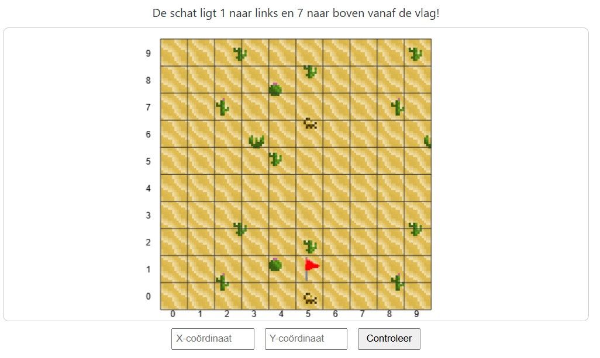
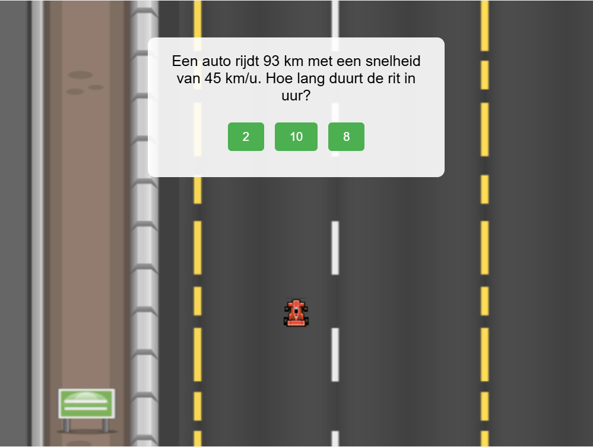

# EduStreakz

## Gemaakt door:

* Yorben Nevelsteen
* Nils Driezen
* Jens coenraads
* Sem Vanderlinden
* Joren Cools
* Robin Anthonissen

## Github repo:

* [Frontend](https://github.com/NilsDriezen/EduStreakz)
* [Backend](https://github.com/NilsDriezen/EduStreakz-Backend)

## Leerdoelen:

* De leerlingen leiden de uitwerking van krachten af uit authentieke contexten.
* De leerlingen bepalen punten in het vlak door middel van coördinaten.
* De leerlingen onderzoeken het verband tussen snelheid, afstand en tijd.

## Games:

1. Game 1 (schattenJacht)  
   

2. Game 2 Rijdend rekenen  
    

